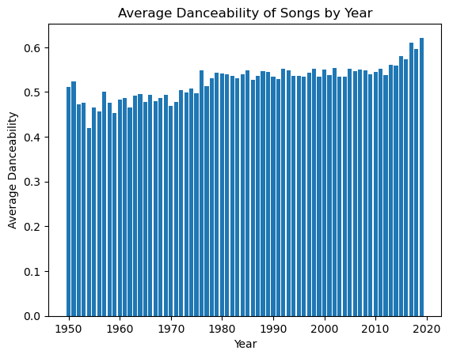
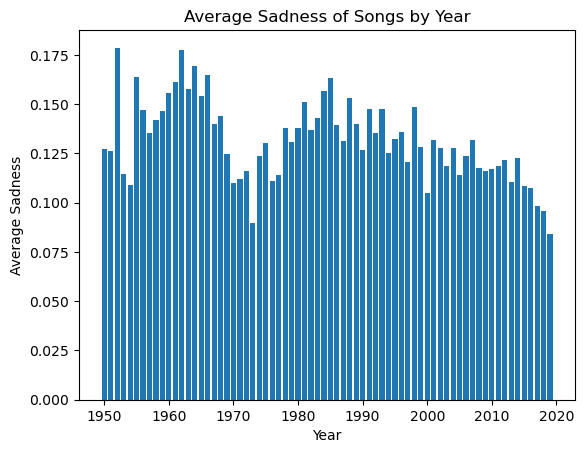
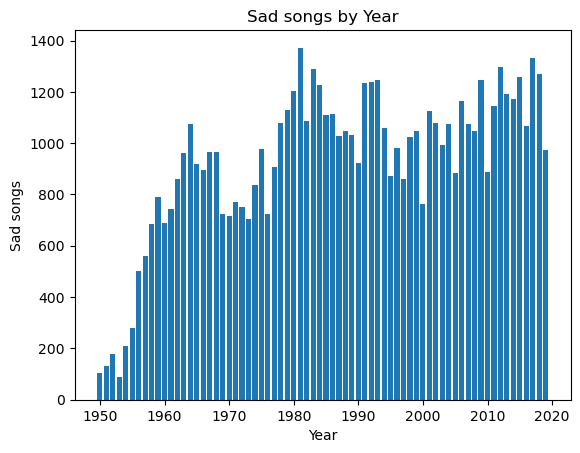
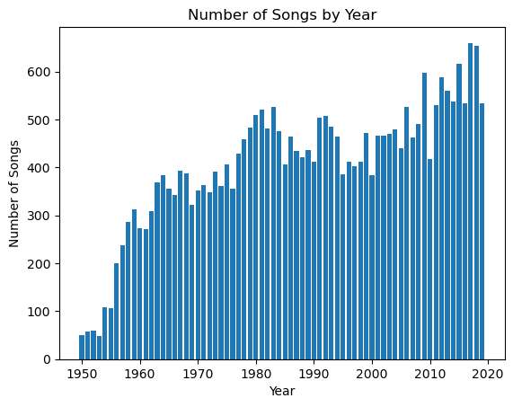

# Preiskovanje povezav med različno glasbo

## 1. Opis problema
Zanima naju kakšne povezave lahko najdeva med različnimi tipi ali žanri glasbe, kot tudi povezave med avtorji. Veva, da v večini avtorji skozi leta spremenijo stil glasbe in naju zanima če je to res in kako se to pozna. Pogledala bova tudi če so se trendi skozi čas zelo spreminjali, tu se bova osredotočila predvsem na spremembo žanrov, kako dobra je pesem za ples in podobno. 

Kot sva navedla že v osnutku je najin največji cilj še vedno podobnost med glasbami kot sem napisal zgoraj podobnost med žanri in temami, kot seveda tudi med ustvarjalci le teh. Tu bova rarzdelila glasbe v več različnih časovnih obdobji in bova znotraj vsakeka poskusila dobiti neke podobnosti, ali le povprečne spremembe med obdobji. 

Podala sva tudi, da bi lahko na podlagi 10 pesmi lahko napovedala uporabniko podobne pesmi. Ampak kot sva že malo pregledala celoten dataset sva ugotovila, da je bila najina hipoteza, da bova v 60% primerov napovedala tako pesem, da bo uporabniku všeč glede na njihov predizbor, malo pre več optimistična, saj so razlike med glasbami zelo male. in bo res težko dobiti najbolj idealno pesem glede na izbor 10ih pesmi.

Pregledala bova tudi kako hitro se povečuje število izdanih pesmi glede na vsako leto. tu bova spremljala tudi različne teme in žanre, ne smo izdaje. 

### Hipoteze
1. V več kot 60% poskusov bova lahko napovedala tako pesem, da bo poslušalcu všeč glede na njegov predizbor desetih pesmi.
2. Po letu 2010 je več pesmi, na katere se bolje pleše (dancability).
3. Na porastu so bolj žalostne pesmi kot včasih, še posebej po letu 2015.
4. Pred letom 2000 je bilo v povprečju manj izdanih pesmi kot po letu 2000.

## 2. Opis podatkov
Za uporabo sva se odločila, da bova uporabila dataset iz spletne strani [Mendeley Data](https://data.mendeley.com/datasets/3t9vbwxgr5/2). V datasetu imamo shranjenih 28373 glasbe in vsaka od njih ima po 30 parametrov, kateri so spodaj našteti in imajo kratek opis. Ta dataset je biu ustvarjen z starejšimi odordji, ki v današnjih dneh nimajo več veliko podpore in niso popularni zato točnih opisov podatkov žal nisva mogla dobiti, npr. "age". Narejen je bil s pomočjo Echo Nest API-ja in pa spotipy, ki je paket za python, kateri se uporablja za pridobivanje glasenih podatkov preko [Spotify-a](https://spotipy.readthedocs.io/).

Podatki: 
 * id - identifikacijska številka skladbe
 * artist_name - umetinkovo ime
 * track_name - naslov glasbe
 * release_date - leto izdaje
 * genre - žanr glasbe (7 skupin)
 * lyrics - besedilo glasbe
 * len - število besed v besedilu
 * dating - ali ima besedilo veliko besed za pare, npr. "baby", "babe", "crazy", "treat"...
 * violence - ali vsebuje veliko besed nasilja
 * world/life - koliko besde vsebuje, ki poudarjajo svet in življenje
 * night/time - koliko besde vsebuje, ki poudarjajo nočni čas
 * shake the audience - koliko besde vsebuje besedilo da pritegne pozornost poslušalcev
 * family/gospel - kolikon besed vsebuj pesem, ki so bolj družinske, npr "lord", "mama", "work", "daddy"...
 * romantic - ali besedilo vsebuje romantične besede, npr. "hold", "love", "sweet"...
 * communication - koliko besed predstavlja komunikacijo
 * obscene - glede na koliko je nespodobno napisano besedilo
 * music - koliko besde opisuje pesmi
 * movement/places - koliko besed predstavlja premikanje
 * light/visual perceptions - besede ki opisjujejo svetlobo in visualna zaznavanja
 * family/spiritual - kolikon besed vsebuj pesem, ki so bolj družinske, npr "people", "free", "land", "young"... 
 * like/girls - koliko besed opisuje dekleta in všečnosst do deklet
 * sadness - koliko besed opisuje žalost 
 * feelings - koliko besde izraža čustva
 * danceability - kako dobro se lahko na njo pleše
 * loudness - povprečna glasnost skozi celotno pesem
 * acousticness - koliko akustičnih glasbil uporablja 
 * instrumentalness - višja kot je manj vokala vsebuje
 * valence - visoka pomeni da je pesem bolj veselo, manjša da je pesem bolj žalostno
 * energy - kako energična je glsaba, več pomeni bolj intenzivna  
 * topic - tema glasbe (8 skupin)
 * age - razpon starosti izražen s številko
  

## 3. Glavne ugotovitve
1. hipoteza
Še ni poterjena saj še vedno delava na modelu. Imava že nek lahek priporočilni sistem, ampak še ni čisto izpopolnjen.

2. hipoteza
Je potrjena, saj se iz spodnjega grafa jasno vidi, da se povečuje dancability. Iz grafa se lepo vidi da se je od 2009 do 2019 dancability povečal za skoraj 0.1. V letu 2009 je bil povpreček 0.5499, v letu 2019 pa 0.6213. Če ne gledamo samo dveh let, smo vzeli obdobje med 1950 do 2009 in od 2010 do 2019. Smo dobili rezultate, da je povprečna dancability v zgodnjih letih bila 0.5244 in v poznih 0.5737, kar je skoraj kot 5% razlike.

3. hipoteza
Tu naju je zelo presenetilo, saj sva se kar krepko zmotila. To je že na prvi pogled vidno iz grafa, da število žalostnih psemi umira. Do leta 2015 je bila povprečna žalostnost pesmi zmanjševala. Najbolj žalostne pesmi so bile izdane 1953. Do leta 2015 je bila povprečna žalostnost pesmi 0.2737, od vključno 2015 naprej pa 0.2238. Če pa gremo gledati samo pesmi, ki imajo kot temp nastavljeno "sadness" pa se malo spremni, potem je pred letom 2015 vrednost žalostnosti 0.4341, po in vključno z letom 2015 pa 0.4195. Razlika se je dosti zmanjšala kar pomeni, da so vseno 
 
4. hipoteza

Pred letom 2000 je bilo v povprečju manj izdanih pesmi kot po letu 2000.

## 4. Izvedene alaize

## 5. Glavni rezultati
